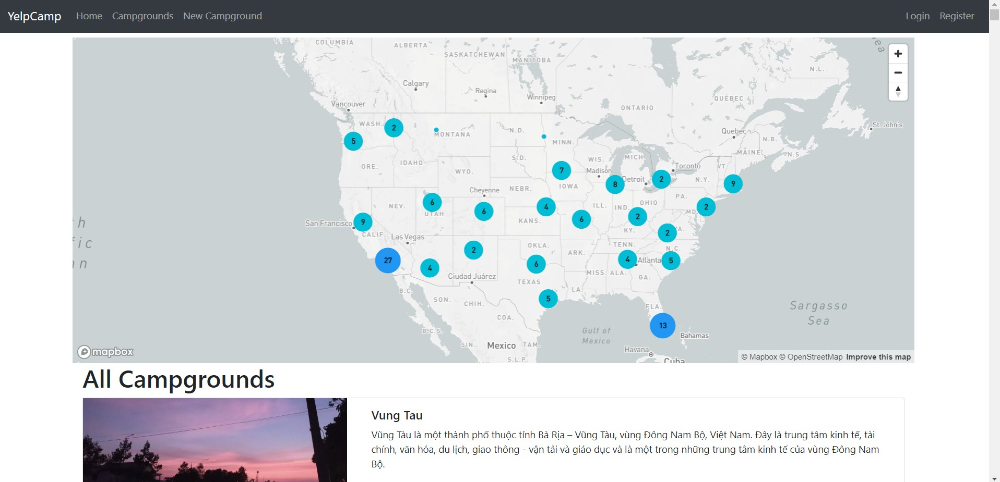

# Camp Scout Three Tier Web Application

This web application allows users to add, view, access, and rate campgrounds by location. It is based on "The Web Developer Bootcamp" by Colt Steele, but includes several modifications and bug fixes. The application leverages a variety of technologies and packages, such as:

- **Node.js with Express**: Used for the web server.
- **Bootstrap**: For front-end design.
- **Mapbox**: Provides a fancy cluster map.
- **MongoDB Atlas**: Serves as the database.
- **Passport package with local strategy**: For authentication and authorization.
- **Cloudinary**: Used for cloud-based image storage.
- **Helmet**: Enhances application security.
- ...

## Setup Instructions

To get this application up and running, you'll need to set up accounts with Cloudinary, Mapbox, and MongoDB Atlas. Once these are set up, create a `.env` file in the same folder as `app.js`. This file should contain the following configurations:

```sh
CLOUDINARY_CLOUD_NAME=[Your Cloudinary Cloud Name]
CLOUDINARY_KEY=[Your Cloudinary Key]
CLOUDINARY_SECRET=[Your Cloudinary Secret]
MAPBOX_TOKEN=[Your Mapbox Token]
DB_URL=[Your MongoDB Atlas Connection URL]
SECRET=[Your Chosen Secret Key] # This can be any value you prefer
```

After configuring the .env file, you can start the project by running:
```sh
docker compose up
```
---
## Overview of GCP Infrastructure Setup using Terraform, Ansible, and Jenkins

The **Camp-Scout** application uses Google Cloud Platform (GCP) to host its infrastructure, including:

- **Google Kubernetes Engine (GKE)**: To manage the application's containerized services.
- **Google Cloud Storage**: For storing Terraform state.
- **Google IAM**: For managing access control.
- **VPCs and Subnets**: For secure networking.

To see the full infrastructure setup instructions, including the Terraform configurations and CI/CD pipeline, please refer to the [detailed GCP infrastructure guide](https://github.com/praks7v/Camp-Scout/tree/gcp-infra) in the `gcp-infra` branch.

---
## Application Screenshots



